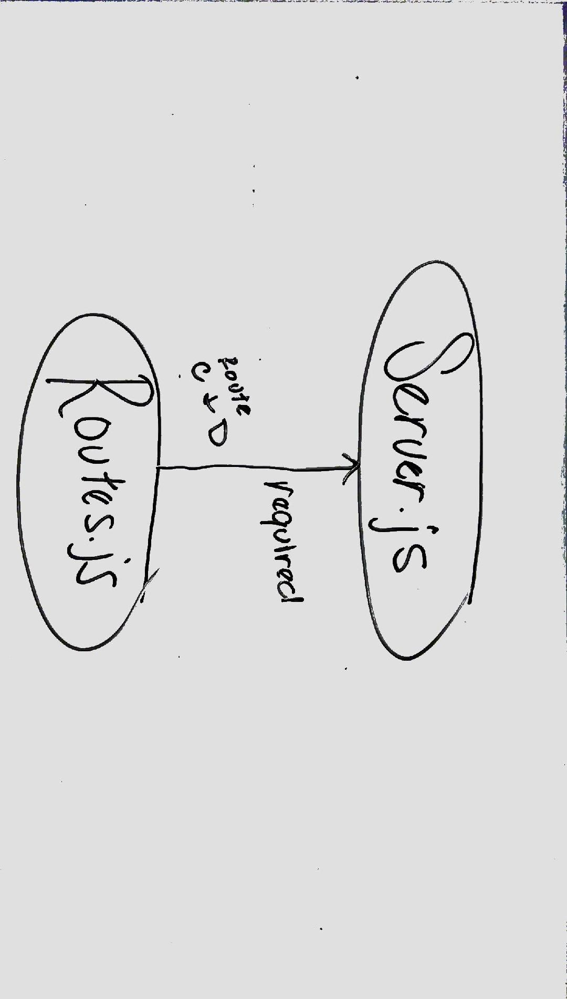

# LAB - 07

## Middleware

### Author: Joseph Hangarter

### Links and Resources
* [submission PR](http://xyz.com)

### Modules
#### `routes.js` - routes c & d with error middleware function for d
#### `server.js` - required routes js.; routes a & b; middleware for `logger`, `requestTime`, `errorHandler`, & `notFound`

### Setup
#### `.env` requirements
* `PORT` - 8080

#### Running the app
* `npm start`
* `nodemon`
  
#### UML

